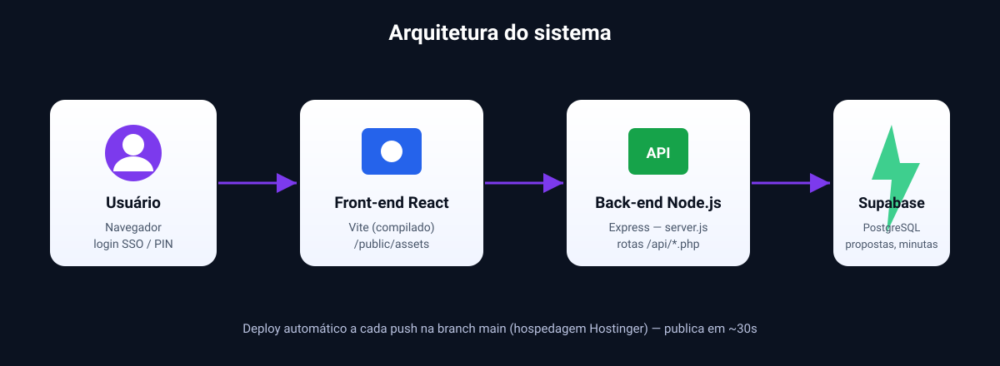
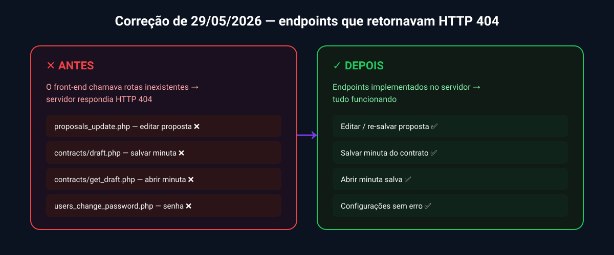

<p align="center">
  
</p>

<p align="center">
  
  
  
  
  
</p>

<p align="center">
  <b>🔗 Acesse:</b> <a href="https://propostas.vpsistema.com">propostas.vpsistema.com</a>
</p>

---

## 📋 Sobre o projeto

**VP Proposta Comercial** é o sistema interno da **VerticalParts** para criação,
gestão e acompanhamento de **propostas comerciais** de elevadores, escadas e
esteiras rolantes. Ele permite montar a proposta completa, gerar a **minuta do
contrato**, marcar propostas como **ganhas** e acompanhar o ranking de vendas.

O acesso é feito pelo **portal vpsistema** (login único / SSO) ou por **PIN
enviado por e-mail**, sem necessidade de senha local.

---

## ✨ Funcionalidades

- 📝 **Criação de propostas** de elevadores, escadas e esteiras rolantes
- ✏️ **Edição** de propostas já criadas (inclusive depois de prontas)
- 📄 **Minuta do contrato** — gera, edita e salva o HTML do contrato por proposta
- 🏆 **Propostas ganhas** — marcar como ganha e controlar a edição
- 👥 **Gestão de usuários** e perfis (Administrador / Gestor / Colaborador)
- 📊 **Ranking de vendas** para a diretoria
- 🔐 **Login por SSO** (portal vpsistema) ou **PIN por e-mail**

---

## 🖼️ Visão geral

<p align="center">
  
</p>

---

## 🚀 Como usar (passo a passo)

1. **Acesse** o sistema pelo portal: entre em [vpsistema.com](https://vpsistema.com)
   e clique no card **Proposta Comercial** (o login é automático via SSO).
2. **Nova proposta** → preencha os dados do cliente, o tipo de equipamento
   (elevador / escada / esteira) e os valores.
3. **Salvar** → a proposta fica disponível na sua lista.
4. **Editar** → abra uma proposta existente, faça os ajustes e salve novamente.
5. **Minuta** → na proposta, gere a minuta do contrato; o conteúdo é salvo
   automaticamente e pode ser reaberto depois.
6. **Marcar como ganha** → ao fechar o negócio, registre o número da proposta
   ganha.

> 👤 **Administradores** (ex.: diretoria/comercial) visualizam e editam **todas**
> as propostas. Demais usuários veem apenas as **suas próprias** propostas.

---

## 🛠️ Histórico de manutenção

| Data | Descrição | Detalhes |
|------|-----------|----------|
| **29/05/2026** | Correção dos endpoints que causavam **HTTP 404** ao salvar/editar propostas e ao salvar/abrir a minuta | [Relatório completo](relatorios/2026_05_29_relatorio.md) |

<p align="center">
  
</p>

---

## 🧱 Stack técnica

| Camada | Tecnologia |
|--------|-----------|
| **Front-end** | React + Vite (bundle compilado em `public/assets/`) |
| **Back-end** | Node.js + Express (`server.js`) |
| **Banco de dados** | Supabase (PostgreSQL) |
| **Autenticação** | JWT + SSO (portal vpsistema) / PIN por e-mail |
| **Hospedagem / Deploy** | Hostinger — **deploy automático** a cada `push` na `main` |

---

## 📁 Estrutura do repositório

```
vp-proposta-comercial/
├── server.js              # Back-end Node.js/Express (API + arquivos estáticos)
├── package.json           # Dependências do servidor
├── public/                # Front-end COMPILADO (servido em produção)
│   ├── index.html         # Bootstrap de login (SSO / PIN) + carregamento do app
│   ├── admin-usuarios.html
│   └── assets/            # JS/CSS do React já compilados
├── docs/                  # Imagens da documentação (este README)
└── relatorios/            # Relatórios de manutenção
    └── 2026_05_29_relatorio.md
```

> ⚠️ **Atenção (manutenção futura):** a pasta `quote-verse-weaver-main/` é um
> **projeto diferente** (RFQ de fornecedores) enviada por engano e **não é** o
> front-end real deste sistema. A interface real é o bundle compilado em
> `public/`. Para alterar o front-end é preciso recompilar a partir do
> código-fonte do app e substituir os arquivos em `public/`.

---

## 💻 Rodando localmente (desenvolvimento)

```bash
# 1. Instalar dependências
npm install

# 2. Definir variáveis de ambiente (mínimo necessário)
#    SB_URL        → URL do projeto Supabase
#    SB_SVC        → service role key do Supabase
#    SB_CENTRAL_URL, SB_CENTRAL_ANON → projeto central (SSO)
#    JWT_SECRET    → segredo para assinar tokens
#    EMAIL_HOST, EMAIL_PORT, EMAIL_USER, EMAIL_PASS → envio de PIN (opcional)

# 3. Subir o servidor
npm start          # produção
npm run dev        # desenvolvimento (reinício automático)
```

O servidor sobe na porta `3000` (ou `PORT`). Diagnóstico rápido em
`GET /api/health`.

---

## 🔌 Principais endpoints da API

| Método | Rota | Função |
|--------|------|--------|
| `POST` | `/api/proposals_create.php` | Criar proposta |
| `POST` | `/api/proposals_update.php` | **Editar/re-salvar proposta** |
| `POST` | `/api/proposals_list.php` | Listar propostas |
| `POST` | `/api/proposals_delete.php` | Excluir proposta |
| `POST` | `/api/proposals_mark_won.php` | Marcar como ganha |
| `POST` | `/api/contracts/draft.php` | **Salvar minuta** |
| `GET`  | `/api/contracts/get_draft.php` | **Abrir minuta** |
| `GET`  | `/api/health` | Diagnóstico (env + Supabase) |

---

<p align="center">
  <sub>VerticalParts © 2026 · Documentação e correções por Claude (Anthropic)</sub>
</p>

---

## Contributors

- Gelson Simões — criador e responsável pelas soluções VerticalParts

---

**Feito por Gelson Simões**
